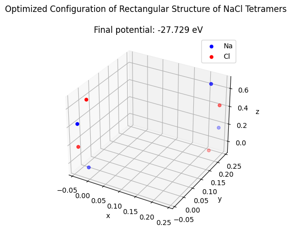
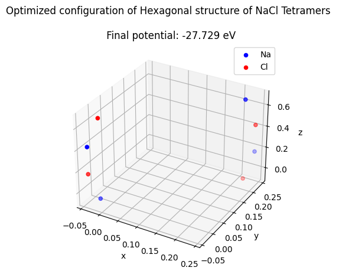
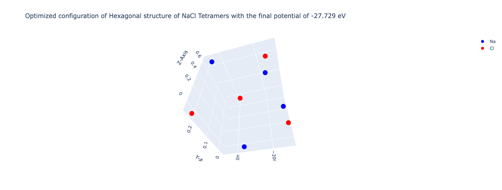

# Na₄Cl₄ Clusters Equilibrium Configurations

This documentation file explains how we implemented the Compphys repository's predefined functions for finding the two equilibrium configurations of Na₄Cl₄ found in the paper [K. Michaelian](https://pubs.aip.org/aapt/ajp/article-abstract/66/3/231/1044856/Evolving-few-ion-clusters-of-Na-and-Cl?redirectedFrom=fulltext).

Here we investigate the potential
 
$$
V\left(r_{i j}\right)=\left\{\begin{array}{l}{-\frac{e^{2}}{4 \pi \epsilon_{0} r_{i j}}+\alpha e^{-r_{i j} / \rho}+b\left(\frac{c}{r_{i j}}\right)^{12}} (\mathrm{+ -})\\ {+\frac{e^{2}}{4 \pi \epsilon_{0} r_{i j}}+b\left(\frac{c}{r_{i j}}\right)^{12}} (\mathrm{++ or --}) \end{array}\right.
$$

where the Coulomb force has constant:

$$ke^2 = e^2/4\pi\epsilon_0 = 1.44\; \mathrm{eV-nm}$$

with Pauli exclusion term:

$$\alpha = 1.09e3\;\mathrm{eV}$$

and a term to stabilize (or "regularize") the computation at small distances with:

$$b = 1.0\;\mathrm{eV}$$

$$c = 0.01\;\mathrm{nm}$$

There are seven configurations for the Na₄Cl₄ tetramer, as shown in the figure. 


## Importing necessary libraries:
```
import numpy as np
import matplotlib.pyplot as plt
from mpl_toolkits.mplot3d import Axes3D
import itertools
import scipy.optimize
Step
```
## Setting Physical constants
```
ke2 = 197 / 137 # eV-nm   Coulomb force charge
alpha = 1.09e3  # eV      parameter of model
rho = 0.0321    # nm      parameter of model
b = 1.0         # eV      regular
c = 0.01        # nm
```

## Defining functions for optimization: 
We will utilize the code in [CompPhys/MinMax/nacl.ipynb](https://github.com/ubsuny/CompPhys/blob/main/MinMax/nacl.ipynb)for optimization.
```
def cp(l):
    return np.fromiter(itertools.chain(*itertools.combinations(l,2)),dtype=int).reshape(-1,2)

class Cluster:
    def __init__(self, r_na, r_cl):
        '''
        Inputs the list of Na and Cl positions. Na has charge +1, Cl has -1.
        The array of ions itself does not change throughout the calculation, and
        neither do the charges. As such, we can just compute the combinations one time
        and refer to it throughout the calculation. 
        '''
        self.positions = np.concatenate( (r_na,r_cl))
        self.charges = np.concatenate( [np.ones(r_na.shape[0]), np.full(r_cl.shape[0], -1)] )
        self.combs = cp(np.arange(self.charges.size))
        self.chargeprods = self.charges[self.combs][:,0] * self.charges[self.combs][:,1]
        self.rij = np.linalg.norm(self.positions[self.combs][:,0] - self.positions[self.combs][:,1], axis=1)

    def Vij(self):
        '''Calculate a numpy vector of all of the potentials of the combinations'''
        self.Vij_ = np.zeros_like(self.rij)
        pos = self.chargeprods>0
        neg = ~pos
        self.Vij_[pos] = ke2 / self.rij[pos] + b*(c/self.rij[pos])**12
        self.Vij_[neg] =-ke2 / self.rij[neg] + alpha*np.exp(-self.rij[neg]/rho) + b*(c/self.rij[neg])**12
        return self.Vij_
    
    def V(self):
        '''Total potential, which is a sum of the Vij vector'''
        return np.sum(self.Vij())
    
    def get_vals(self):
        '''Positions interpreted as a flat shape'''
        return np.reshape(self.positions, -1)
        
    def set_vals(self, vals ):        
        '''Inputs flat shape of positions, used by __call__'''
        self.positions = vals.reshape(self.positions.shape)
        self.rij = np.linalg.norm(self.positions[self.combs][:,0] - self.positions[self.combs][:,1], axis=1)

    
    def __call__(self, vals):
        '''Function that  scipy.optimize.minimize will call'''
        self.set_vals(vals)
        return self.V()
```


# In this section, we will set the initial guess and run the simulation for the optimization. 
## 1. Rectangular Configuration: 


## Simulation initialization
We set the initial equlibrium distance between two ion's as a = 0.2
```
a = 0.2

r_na = np.array([ [ 0, 0, 0], [ 2 * a, -0.2 * a, 0],  [ 3 * a, a, 0 ], [ a, 1.2 * a, 0 ] ])
r_cl = np.array([ [ a, -0.2 * a, 0 ], [ 3 * a, 0, 0 ], [ 2 * a, 1.2 * a, 0 ], [ 0, a, 0 ] ])

cluster = Cluster(r_na, r_cl)
vals_init = cluster.get_vals()
print('initial Na positions:\n', r_na)
print('initial Cl positions:\n', r_cl)
print('initial positions flattened shape:\n', vals_init )
print('initial V  :', cluster.V() )
```
And got the output as follows:
```
initial Na positions:
 [[ 0.    0.    0.  ]
 [ 0.4  -0.04  0.  ]
 [ 0.6   0.2   0.  ]
 [ 0.2   0.24  0.  ]]
initial Cl positions:
 [[ 0.2  -0.04  0.  ]
 [ 0.6   0.    0.  ]
 [ 0.4   0.24  0.  ]
 [ 0.    0.2   0.  ]]
initial positions flattened shape:
 [ 0.    0.    0.    0.4  -0.04  0.    0.6   0.2   0.    0.2   0.24  0.
  0.2  -0.04  0.    0.6   0.    0.    0.4   0.24  0.    0.    0.2   0.  ]

initial potential V  : -22.204496183502798 eV
```
## Run the optimization
```
res = scipy.optimize.minimize( fun=cluster, x0=vals_init, tol=1e-3, method="CG")
cluster.set_vals(res.x)  # For some reason, "minimize" is not updating the class at the last iteration
print ("Final optimized cluster positions")
print(cluster.positions)
print("Final potential:", res.fun)
```

## Output:
```
Final optimized cluster positions
[[-7.61416559e-02 -2.18168536e-02 -1.24197016e-08]
 [ 4.26813727e-01 -4.07182453e-02 -2.49869158e-08]
 [ 6.76141095e-01  2.21816583e-01 -7.10867277e-09]
 [ 1.73185687e-01  2.40718031e-01 -2.22357265e-08]
 [ 1.73185695e-01 -4.07182496e-02 -2.53937023e-08]
 [ 6.76141088e-01 -2.18168522e-02 -1.05038708e-08]
 [ 4.26813735e-01  2.40718028e-01 -2.27758258e-08]
 [-7.61416635e-02  2.21816581e-01 -6.13540411e-09]]
Final potential: -27.729842284654904
```
## 3D Graphical Image for the equilibrium state:


## Interactive 3D Plot


## 2. Hexagonal (5th) Configuration 


## Simulation initialization
We set the initial equlibrium distance between two ion's as a = 0.2
```
a = 0.2

r_na = np.array([ [-a,0,0], [1.1*a,0,0], [2.1*a,0,-0.5*a], [0.3*a,0.1*a,-a] ])
r_cl = np.array([ [0,-a,0], [2.1*a,0,0], [1.1*a,0,-0.5*a], [0,a,0] ])

cluster = Cluster(r_na, r_cl)
vals_init = cluster.get_vals()
print('initial Na positions:\n', r_na)
print('initial Cl positions:\n', r_cl)
print('initial positions flattened shape:\n', vals_init )
print('initial V  :', cluster.V() )
```
## Output:
```
initial Na positions:
 [[-0.2   0.    0.  ]
 [ 0.22  0.    0.  ]
 [ 0.42  0.   -0.1 ]
 [ 0.06  0.02 -0.2 ]]
initial Cl positions:
 [[ 0.   -0.2   0.  ]
 [ 0.42  0.    0.  ]
 [ 0.22  0.   -0.1 ]
 [ 0.    0.2   0.  ]]
initial positions flattened shape:
 [-0.2   0.    0.    0.22  0.    0.    0.42  0.   -0.1   0.06  0.02 -0.2
  0.   -0.2   0.    0.42  0.    0.    0.22  0.   -0.1   0.    0.2   0.  ]
initial V  : 60.430145184856165
```
## Run the optimization
```
res = scipy.optimize.minimize( fun=cluster, x0=vals_init, tol=1e-3, method="CG")
cluster.set_vals(res.x)  # For some reason, "minimize" is not updating the class at the last iteration
print ("Final optimized cluster positions")
print(cluster.positions)
print("Final potential:", res.fun)
```
## Output:
```
Final optimized cluster positions
[[ 0.01925307  0.07906049  0.07177112]
 [ 0.19058656 -0.11603468  0.3240974 ]
 [ 0.09435918  0.12098401 -0.42413406]
 [ 0.26577277 -0.07402928 -0.1717912 ]
 [ 0.23519174 -0.10129502  0.07850662]
 [ 0.00364829  0.04009854  0.31826605]
 [ 0.28129588 -0.03515154 -0.41830544]
 [ 0.04983264  0.10632953 -0.17852468]]
Final potential: -27.729842270467213
```
## 3D Graphical Image for the equilibrium state:


## 3D Graphical Image for the equilibrium state:



# GitHub Actions for nacl_main.py: Linting
We linted the main Python file **nacl_main.py** using pylint and the output is below:

