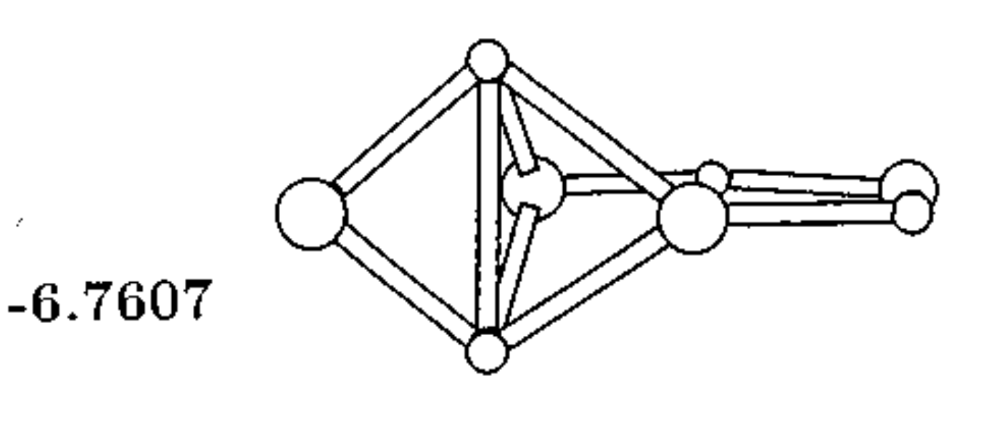

# Na₄Cl₄ Clusters Equilibrium Configurations

This documentation file explains how we implemented the Compphys repository's predefined functions for finding the two equilibrium configurations of Na₄Cl₄ found in the paper [K. Michaelian](https://pubs.aip.org/aapt/ajp/article-abstract/66/3/231/1044856/Evolving-few-ion-clusters-of-Na-and-Cl?redirectedFrom=fulltext).

Here we investigate the potential
 
$$
V\left(r_{i j}\right)=\left\{\begin{array}{l}{-\frac{e^{2}}{4 \pi \epsilon_{0} r_{i j}}+\alpha e^{-r_{i j} / \rho}+b\left(\frac{c}{r_{i j}}\right)^{12}} (\mathrm{+ -})\\ {+\frac{e^{2}}{4 \pi \epsilon_{0} r_{i j}}+b\left(\frac{c}{r_{i j}}\right)^{12}} (\mathrm{++ or --}) \end{array}\right.
$$

where the Coulomb force has constant:

$$ke^2 = e^2/4\pi\epsilon_0 = 1.44\; \mathrm{eV-nm}$$

with Pauli exclusion term:

$$\alpha = 1.09e3\;\mathrm{eV}$$

and a term to stabilize (or "regularize") the computation at small distances with:

$$b = 1.0\;\mathrm{eV}$$

$$c = 0.01\;\mathrm{nm}$$

There are seven configurations for the Na₄Cl₄ tetramer, as shown in the figure. 


We will utilize the code in [CompPhys/MinMax/nacl.ipynb](https://github.com/ubsuny/CompPhys/blob/main/MinMax/nacl.ipynb)for optimization.

## Importing necessary libraries:
```
import numpy as np
import matplotlib.pyplot as plt
from mpl_toolkits.mplot3d import Axes3D
import itertools
import scipy.optimize
Step
```
## Setting Physical constants
```
ke2 = 197 / 137 # eV-nm   Coulomb force charge
alpha = 1.09e3  # eV      parameter of model
rho = 0.0321    # nm      parameter of model
b = 1.0         # eV      regular
c = 0.01        # nm
```

## Configuration Rectangular 


## Configuration Hexagonal (5th)

